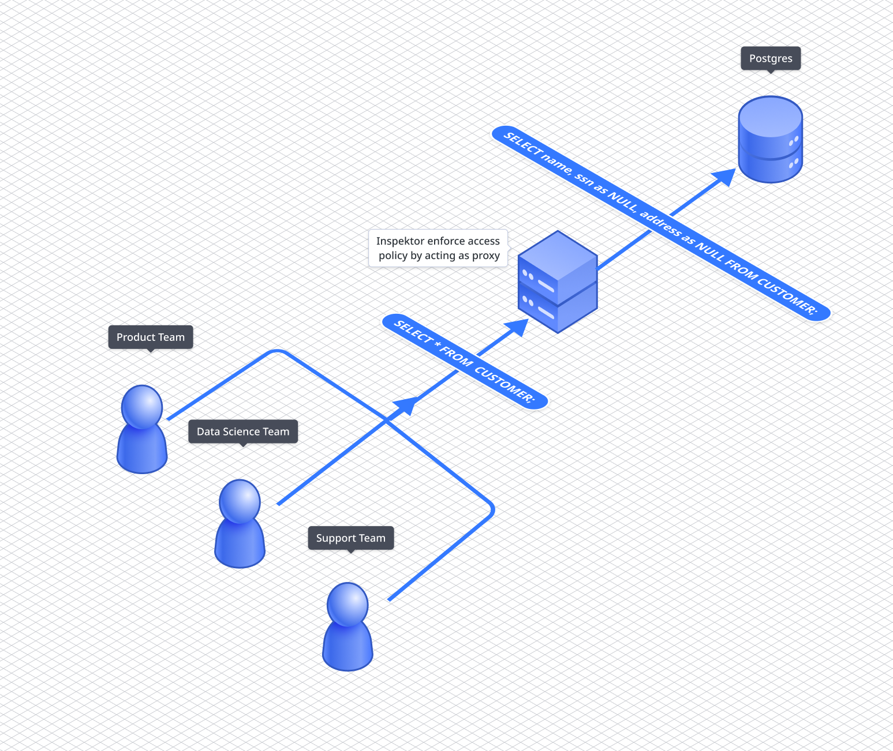

<p align="center">
  
</p>

<h1 align="center">Inspektor</h1>
<p align="center">
  <a href="https://github.com/poonai/inspektor/actions/workflows/rust.yml"></a>
      <a href="https://github.com/poonai/inspektor/blob/main/LICENSE"></a>
<a href="https://discord.gg/YxZbDJHTxf"></a>

      

</p>

## What is Inspektor?
Inspektor is a tool that helps you manage database access in a much better manner. Inspektor's main purpose is to act as a "man in the middle" proxy between your application and database, making it easy to enforce access policies.

Inspektor enables you to define access policy as code. This is a big deal for operations and development. Using OPA (the open policy agent), you can express policies that are trusted, human-readable, and easy to understand.

Inspektor enables teams to protect, and control their databases, data pipelines, and data warehouses by intercepting requests in real-time, without impact on performance or scalability. 

Here are a few places where Inspektor can act as a good tool to use.

## Use Cases
- Create access credentials in no time for your dev team to debug
- Manage all your data policies in a centralized place and avoid managing data policies in silos
- Protect PPI data of your customers while collaborating
- Avoid dangerous commands like `DELETE`,`UPDATE` accidentally. 

## The OPA(Open-Policy-Agent).

OPA is used for a unified toolset and framework for policy across the cloud-native stack. Use OPA to release, analyze, and review policies without sacrificing availability or performance.

Here is the example policy, written using rego. This example policy allows users with ‘support’ roles to modify the shipped column of the claimed_items table and hides the email column of the customer table from the users with the ‘support’ role.

```
package inspektor.resource.acl

default allow = false

default protected_attributes = []

default allowed_attributes = []

role_permission := {
"support": [{"postgres-prod": {

# insert is not allowed for the support roles.
"insert": {"allowed": false, "allowed_attributes": {}},
 
 # shipped column of claimed_items only allowed to update
"update": {"allowed": true, "allowed_attributes": {"prod.public.claimed_items.shipped"}},

 # copy is not allowed
"copy": {"allowed": false, "allowed_attributes": {}, "protected_attributes":{}},
 
# support role can view every columns of the database except email column of customers table.
"view": {"allowed": true, "protected_attributes": {"http://prod.public.customers.email"}}, }}],
}

# retrive all the resources that can be accessible by the 
# incoming groups. eg: support, admin, dev
resources[resource] {
resource = role_permission[input.groups[_]][_]
}

# retrive all the permissions for the given datasource and
# action. eg: view, update 
permission = resources[_][input.datasource][input.action]

#  this permission is allowed.
allow {
permission. allowed
}

# what are the attributes that are allowed to 
# modify
allowed_attributes = intersection(attributes) {
attributes := {attribute | attribute := permission.allowed_attributes}
}

# attributes that needs to be hidden 
# to the user.
protected_attributes = intersection(attributes) {
attributes := {attributes | attributes := permission.protected_attributes}
}
```

## Architecture
Inspektor comprises 2 main components. 
1. The Control Plane
2. The Data Plane
### The Control Plane:
The control plane acts as a management service that dynamically configures your data plane in order to enforce policies. 

It is like a control center where an admin can configure and access all the roles of a particular employee or a user.

### The Data Plane:
The data plane is deployed along with your data service. Dataplane enforces the access policies on all the queries that are coming to your database by intercepting the network traffic.

<p align="center">
  
</p>


## Supported Data Source
 - Postgres
 
## Planned Data Sources
 - Snowflake
 - MongoDB
 - MYSQL
 - S3

## Join Us!
*Inspektor is an open-source project. If you have some more amazing ideas to improve Inspektor or if you find some bugs or critical errors in the current code, then please let us know by joining the [Inspektor Discord](https://discord.gg/VsZbJw5v). You can also visit the Github Discussion.*

