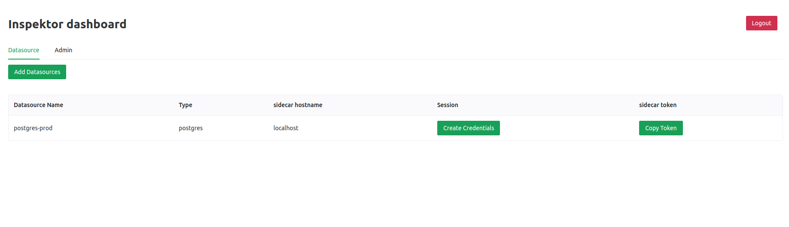
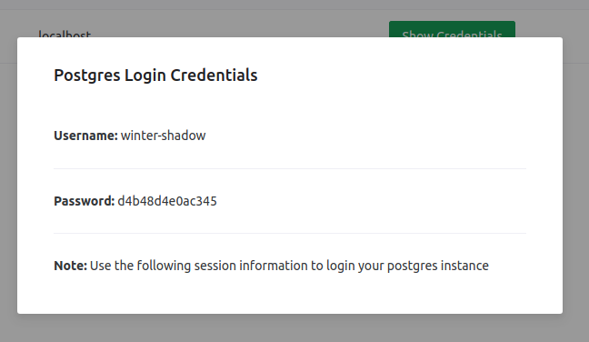

In this tutorial, you'll be downloading and getting familiar with the basics of Inspektor.

## Prerequisites
 - docker
 - docker-compose
 - git
 - psql


## Inspektor Local Setup

Clone the given repository in your local machine and change your current working directory to the cloned repository.
https://github.com/poonai/inspektor-demo

```sh
git clone https://github.com/poonai/inspektor-demo
cd inspektor-demo
```

The cloned repository contains necessary files to setup a local inspektor environment.


### Postgres setup
Run the docker-compose file to run Postgres instance with some sample seeding data. Postgres is required by the inspektor's controlplane to store all metadata.


```sh
docker-compose up
```

This is how the docker-compose.yaml file looks like

```yaml title="docker-compose.yaml"
version: '3.8'

services:
  postgres:
    container_name: postgres_systest_container
    image: postgres:13.5
    environment:
        POSTGRES_USER: "postgres"
        POSTGRES_PASSWORD: "postgrespass"
    ports:
     - 5432:5432
    restart: unless-stopped
```

**Note:** You must have Docker up and running for your respective system before you do `docker-compose up`.

Refer here for [macOS](https://docs.docker.com/desktop/mac/install/), [Linux](https://docs.docker.com/engine/install/ubuntu/) and [Windows](https://docs.docker.com/desktop/windows/install/) setup of Docker if you don't already have the setup ready.

:::tip
- You need to install Docker Engine for Linux systems (Docker Desktop for Linux is currently in beta)
- You need to install only Docker Desktop for macOS and Windows based systems.
:::

You can move to the next steps after you see the following logs.

```shell
postgres_demo_container | 2022-01-19 10:09:23.152 UTC [49] LOG:  received fast shutdown request
postgres_demo_container | waiting for server to shut down....2022-01-19 10:09:23.158 UTC [49] LOG:  aborting any active transactions
postgres_demo_container | 2022-01-19 10:09:23.159 UTC [49] LOG:  background worker "logical replication launcher" (PID 56) exited with exit code 1
postgres_demo_container | 2022-01-19 10:09:23.159 UTC [51] LOG:  shutting down
postgres_demo_container | 2022-01-19 10:09:23.244 UTC [49] LOG:  database system is shut down
postgres_demo_container |  done
postgres_demo_container | server stopped
postgres_demo_container | 
postgres_demo_container | PostgreSQL init process complete; ready for start up.
postgres_demo_container | 
postgres_demo_container | 2022-01-19 10:09:23.283 UTC [1] LOG:  starting PostgreSQL 13.5 (Debian 13.5-1.pgdg110+1) on x86_64-pc-linux-gnu, compiled by gcc (Debian 10.2.1-6) 10.2.1 20210110, 64-bit
postgres_demo_container | 2022-01-19 10:09:23.283 UTC [1] LOG:  listening on IPv4 address "0.0.0.0", port 5432
postgres_demo_container | 2022-01-19 10:09:23.283 UTC [1] LOG:  listening on IPv6 address "::", port 5432
postgres_demo_container | 2022-01-19 10:09:23.296 UTC [1] LOG:  listening on Unix socket "/var/run/postgresql/.s.PGSQL.5432"
postgres_demo_container | 2022-01-19 10:09:23.310 UTC [64] LOG:  database system was shut down at 2022-01-19 10:09:23 UTC
postgres_demo_container | 2022-01-19 10:09:23.380 UTC [1] LOG:  database system is ready to accept connections

```

Reach out to us in case the logs looks different from the one we provided above. 


### Controlplane Setup

After Postgres, we have to run the control plane. The config file to run the control plane is already present in the cloned repository. 


Here is the sample config file of controlplane.

**Note: read the comments to know more about config file. **
```yaml title="controlplane_config.yaml"
# postgres credentials to store metadata
postgres_host: "localhost"
postgres_port: "5432"
database_name: "postgres"
postgres_username: "postgres"
postgres_password: "postgrespass"
jwt_key: "demokey"
# github repository of access policy. Since inspektor use OPA 
# to enforce access policies
policy_repo: "https://github.com/poonai/inspektor-policy.git"
github_access_token: ""
```
The below command will run the controlplane and mount the config file as volume to the container.

```sh
docker run -v $(pwd)/config.yaml:/config.yaml --network=host  schoolboy/inspektor-controlplane:latest ./inspektor
```

After this, you can hit [http://localhost:3123](http://localhost:3123/) on the browser to go to inspektor's dashboard, where you can create datasource (A database which you want to connect with inspektor). 

Use the following credentials. 
```
username: admin
password: admin
```


### Dataplane Setup

The seeded database already contains configured datasource so, we don't need to configure datasource for this tutorial. But please feel free to get your hands dirty :P 

Dataplane also needs config file to run. The dataplane config file also present in the cloned repository 


Here is the sample dataplane config file. 

```yaml title="dataplane_config.yaml"
# type of datasource
driver_type: "postgres"
# control plane address
controlplane_addr: "localhost:5003"
# secret token that is used to connect dataplane with controlplane. This 
# can be retrived from the dashboard.
secret_token: "b5571a086fb62180cf5493a4a6555a641dede6a45048fda0d79b24fc9a8e"
# postgres_config contains the credentials of datasource that we want to connect
# for the simplicity we are using the same database that we are using to store 
# all inspektor metadata.
postgres_config:
  target_addr: "localhost"
  target_port: "5432"
  target_username: "postgres"
  target_password: "postgrespass"
  proxy_listen_port: "8081"
```

Run the below command to run the dataplane.

```sh
docker run -v $(pwd)/dataplane_config.yaml:/dataplane_config.yaml --network=host -e RUST_LOG=inspektor=debug schoolboy/inspektor-dataplane:latest1 ./inspektor --config_file ./dataplane_config.yaml
```

## Inspektor basic features

The installation steps will run a Postgres instance, controlplane and dataplane. The dataplane is connected to the same Postgres container that is used by controlplane to store metadata to ease out the complexitiy. But, you can connect to any Postgres instance as you like by tinkering with the dataplane config file.

In this sample database, we want to protect first_name of the actor table. For this, we have to define policy using Open Policy Agent. We have already defined that policy on [sample repository here.](https://github.com/poonai/inspektor-policy.git)


Now hit the [http://localhost:3123](http://localhost:3123) and use the following credentials to login into the dashboard.

```
username: admin
password: admin
```

After login, you'll see the list of datasources that controlplane manages. 



The Postgres instance that we want to enforce policy is already added as datasource, now you can click on create credentials button to get login information to access the datasource.

After creating the credentials you'll get to see show credentials button. After clicking you'll get a modal showing the credentials to access the Postgres instance.



Now just use psql to login to the Postgres instance using the copied credentials from the dashboard.

```
psql "sslmode=disable host=localhost port=8081 dbname=postgres user=<username>"
```

After executing the above command, psql will prompt you to enter password. Enter the password
which you copied from the modal to login.

Now that, you logged in. execute a simple select query on the actor table.

```sql
select * from actor;
```

You'll get output similar to this.
```
 actor_id | first_name |  last_name   |      last_update       
----------+------------+--------------+------------------------
        1 |            | GUINESS      | 2020-02-15 09:34:33+00
        2 |            | WAHLBERG     | 2020-02-15 09:34:33+00
        3 |            | CHASE        | 2020-02-15 09:34:33+00
        4 |            | DAVIS        | 2020-02-15 09:34:33+00
        5 |            | LOLLOBRIGIDA | 2020-02-15 09:34:33+00
        6 |            | NICHOLSON    | 2020-02-15 09:34:33+00
        7 |            | MOSTEL       | 2020-02-15 09:34:33+00
        8 |            | JOHANSSON    | 2020-02-15 09:34:33+00
        9 |            | SWANK        | 2020-02-15 09:34:33+00
       10 |            | GABLE        | 2020-02-15 09:34:33+00
       11 |            | CAGE         | 2020-02-15 09:34:33+00
       12 |            | BERRY        | 2020-02-15 09:34:33+00
       13 |            | WOOD         | 2020-02-15 09:34:33+00
       14 |            | BERGEN       | 2020-02-15 09:34:33+00
       15 |            | OLIVIER      | 2020-02-15 09:34:33+00
       16 |            | COSTNER      | 2020-02-15 09:34:33+00
       17 |            | VOIGHT       | 2020-02-15 09:34:33+00
       18 |            | TORN         | 2020-02-15 09:34:33+00
       19 |            | FAWCETT      | 2020-02-15 09:34:33+00
       20 |            | TRACY        | 2020-02-15 09:34:33+00
       21 |            | PALTROW      | 2020-02-15 09:34:33+00

```

You can clearly see that first_name has been hidden from the user by inspektor. Now, get your hands dirty by forking inspektor demo policy repo and play with inspektor. Probably, you can run an insert statement. 

We are active on discord, so if you need any help please do reach out to us. We are more than happy to help you. Here is the discord invite link:  https://discord.com/invite/YxZbDJHTxf.

See you soon. Can't wait to see what cool things you can do with Inspektor. 